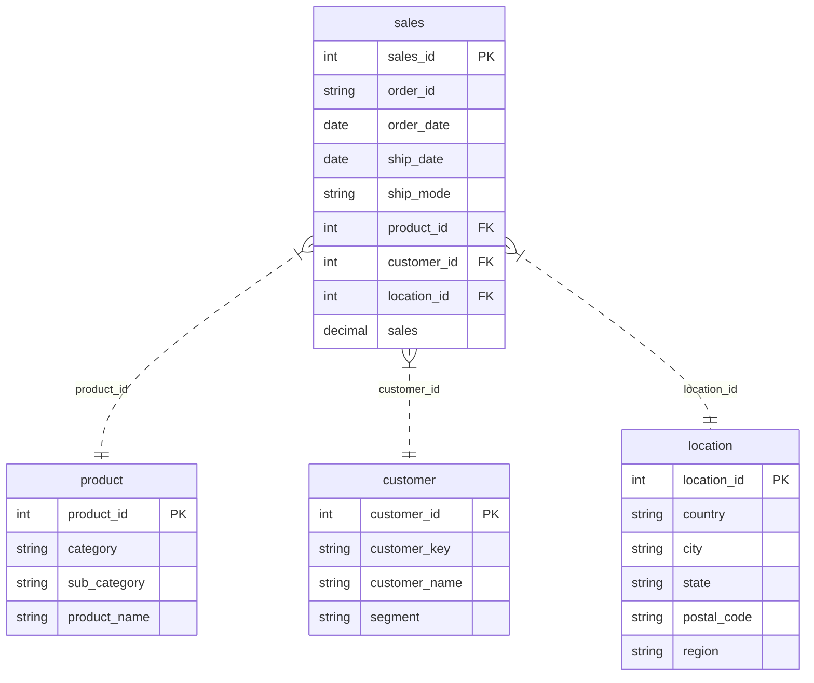

# Conversation Summary

## Overview

This session focused on designing and executing a target SQL schema based on `[superstore].[dbo].[sales]`.

The final intended target schema is `store`.

---

## Data Model and SQL Work

### Source reviewed
- `sales.sql`
- `SalesModelDocumentation.md`

### What was derived from the source
- Source table: `[superstore].[dbo].[sales]`
- Core analytical entities identified:
  - `product`
  - `customer`
  - `location`
  - `sales` fact table

### Target design implemented
A star schema was created under the `store` schema with these tables:

#### `store.product`
- `product_id` as integer surrogate key
- `category`
- `sub_category`
- `product_name`

#### `store.customer`
- `customer_id` as integer surrogate key
- `customer_key` as the source business key
- `customer_name`
- `segment`

#### `store.location`
- `location_id` as integer surrogate key
- `country`
- `city`
- `state`
- `postal_code`
- `region`

#### `store.sales`
- `sales_id` mapped from source `Row_ID`
- `order_id`
- `order_date`
- `ship_date`
- `ship_mode`
- `product_id`
- `customer_id`
- `location_id`
- `sales`

### Supporting implementation details
- Added primary keys on all tables.
- Added foreign keys from `store.sales` to the three dimensions.
- Added uniqueness constraints to dimension business attributes.
- Added indexes on key fact table lookup columns.
- Used deterministic joins from source attributes to generated surrogate keys.

---

## Files Created or Updated

### Created
- `target_schema.sql`
- `ConversationSummary.md`

### Updated
- `SalesModelDocumentation.md`

---

## SQL Execution Steps

### Environment discovery
- Discovered a saved SQL Server instance:
  - `.\sqlexpress`
- Confirmed the `superstore` database exists.
- Confirmed `sqlcmd` is installed locally.

### SQL connectivity notes
- The first command-line execution attempt failed because the ODBC 18 client enforced certificate validation.
- The script was rerun successfully with trusted certificate mode enabled.

### Execution command used
```powershell
& "C:\Program Files\Microsoft SQL Server\Client SDK\ODBC\180\Tools\Binn\SQLCMD.EXE" -S ".\sqlexpress" -E -C -d "superstore" -b -i "c:\Users\pbv01\Desktop\sales project\target_schema.sql"
```

### Final row counts returned by the script
```text
product   1849
customer   793
location   628
sales     9800
```

### Result
- The `store` schema tables were created and loaded successfully in the `superstore` database.

---

## Documentation Updates

`SalesModelDocumentation.md` was updated to align with the implemented model:
- The target schema reference was updated to `store`.
- Surrogate keys were documented as integers.
- `postal_code` was documented as text.
- Fact table date columns were documented as `date`.

---

## End State

At the end of the session:

- A clean target schema build script exists in `target_schema.sql`.
- The target analytical schema is `store`.
- The schema was executed successfully against `.\sqlexpress` in the `superstore` database.
- The project documentation now reflects the intended target model.

---

## Entity Relationship Diagram

