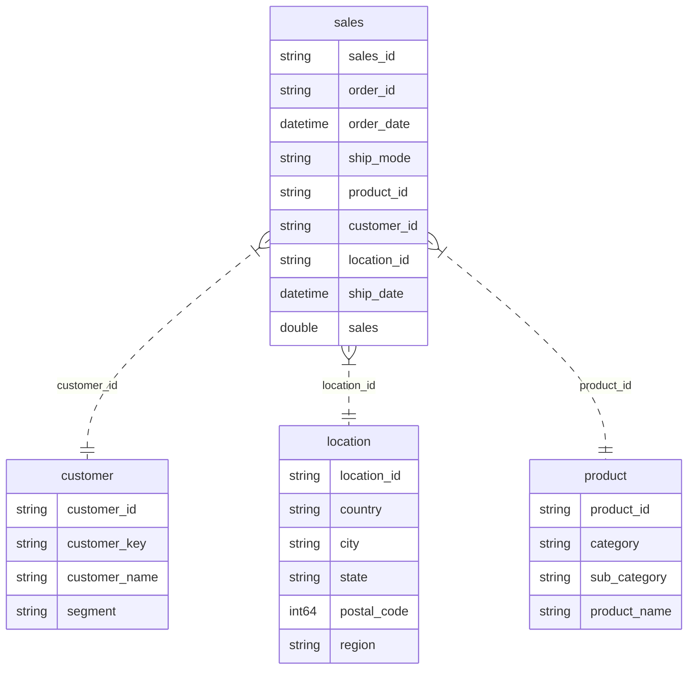

# Sales Analytics Data Model

## Executive Summary

The Sales Analytics Data Model provides a robust foundation for analyzing sales performance across products, customers, locations, and time. It is designed to empower management with actionable insights for strategic decision-making, including revenue trends, customer segmentation, and regional performance.

---

## Model Structure Overview

The model follows a classic star schema, ensuring clarity, scalability, and high performance for business intelligence reporting.

**Fact Table:**
- `sales`: Central table capturing all sales transactions, including references to products, customers, locations, and transaction details.

**Dimension Tables:**
- `product`: Details about each product, including category and sub-category.
- `customer`: Information on each customer and their segment.
- `location`: Geographic attributes for each transaction.

---

## Table Definitions

### sales (Fact Table)
Captures every sales transaction, linking to product, customer, and location dimensions, and recording transaction amounts and dates.

### product (Dimension)
Contains product-level details, supporting analysis by product name, category, and sub-category.

### customer (Dimension)
Holds customer information, enabling segmentation and customer-centric reporting.

### location (Dimension)
Defines the geographic context for each sale, supporting regional and market analysis.

---

## Column Definitions

### sales
| Column        | Description                                              |
|-------------- |---------------------------------------------------------|
| sales_id      | Unique identifier for each sales transaction            |
| order_id      | Identifier for the sales order                          |
| order_date    | Date the order was placed                               |
| ship_mode     | Shipping method used for the order                      |
| product_id    | Foreign key to the product table                        |
| customer_id   | Foreign key to the customer table                       |
| location_id   | Foreign key to the location table                       |
| ship_date     | Date the order was shipped                              |
| sales         | Revenue amount for the transaction                      |

### product
| Column        | Description                                              |
|-------------- |---------------------------------------------------------|
| product_id    | Unique identifier for each product                      |
| product_name  | Name of the product                                     |
| category      | Product category (e.g., Technology, Furniture)          |
| sub_category  | More granular product classification                    |

### customer
| Column        | Description                                              |
|-------------- |---------------------------------------------------------|
| customer_id   | Unique identifier for each customer                     |
| customer_key  | Alternate key for customer                              |
| customer_name | Name of the customer                                    |
| segment       | Customer segment (e.g., Consumer, Corporate)            |

### location
| Column        | Description                                              |
|-------------- |---------------------------------------------------------|
| location_id   | Unique identifier for each location                     |
| country       | Country of the location                                 |
| region        | Region within the country                               |
| state         | State or province                                       |
| city          | City name                                               |
| postal_code   | Postal or ZIP code                                      |

---

## Best Practices & Recommendations

- Add a dedicated Date dimension for advanced time intelligence (YTD, YoY, etc.)
- Define DAX measures for key metrics (e.g., Total Sales, Average Sales)
- Hide technical columns (IDs, row numbers) from report view for clarity
- Document all tables and columns for maintainability

---

*Prepared for management review. For questions or updates, contact the analytics team.*

# Sales Semantic Model ERD

## Entity Relationship Diagram (ERD)

## Table Details

### customer
* customer_id (string)
* customer_key (string)
* customer_name (string)
* segment (string)

### location
* location_id (string)
* country (string)
* city (string)
* state (string)
* postal_code (int64)
* region (string)

### product
* product_id (string)
* category (string)
* sub_category (string)
* product_name (string)

### sales
* sales_id (string)
* order_id (string)
* order_date (datetime)
* ship_mode (string)
* product_id (string)
* customer_id (string)
* location_id (string)
* ship_date (datetime)
* sales (double)

## Relationships

- sales.customer_id → customer.customer_id
- sales.location_id → location.location_id
- sales.product_id → product.product_id
