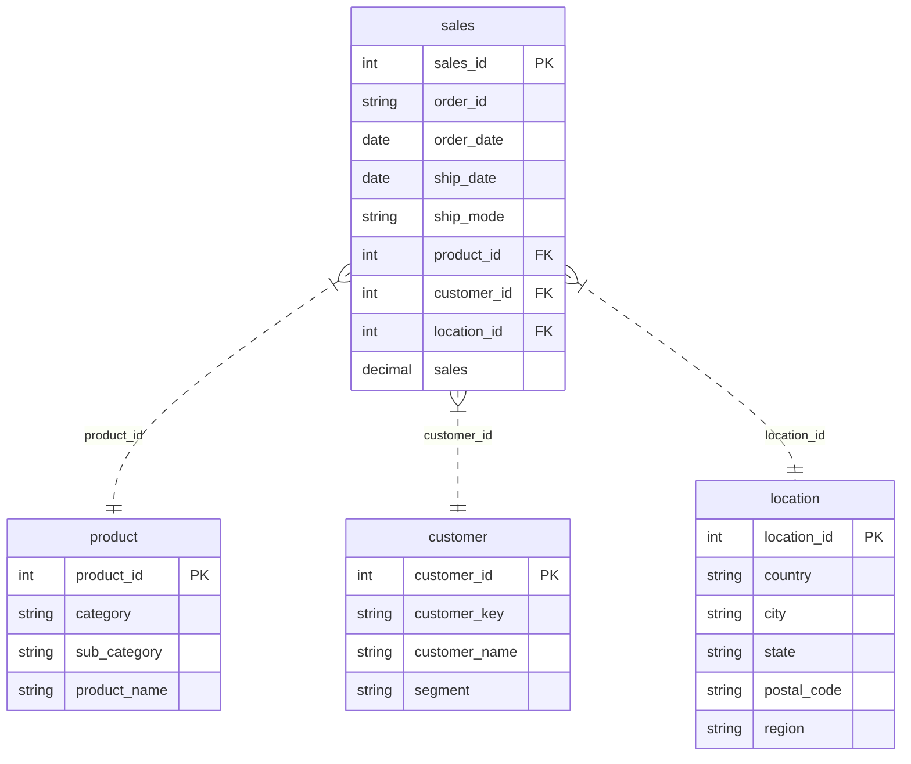

# Target Schema Automation

## Overview

This session focused on designing and executing a target SQL schema based on `[superstore].[dbo].[sales]`.

The final intended target schema is `store`.

---

## Data Model and SQL Work

### Source reviewed
- `sales.sql`
- `SalesModelDocumentation.md`

### What was derived from the source
- Source table: `[superstore].[dbo].[sales]`
- Core analytical entities identified:
  - `product`
  - `customer`
  - `location`
  - `sales` fact table

### Target design implemented
A star schema was created under the `store` schema with these tables:

#### `store.product`
- `product_id` as integer surrogate key
- `category`
- `sub_category`
- `product_name`

#### `store.customer`
- `customer_id` as integer surrogate key
- `customer_key` as the source business key
- `customer_name`
- `segment`

#### `store.location`
- `location_id` as integer surrogate key
- `country`
- `city`
- `state`
- `postal_code`
- `region`

#### `store.sales`
- `sales_id` mapped from source `Row_ID`
- `order_id`
- `order_date`
- `ship_date`
- `ship_mode`
- `product_id`
- `customer_id`
- `location_id`
- `sales`

### Supporting implementation details
- Added primary keys on all tables.
- Added foreign keys from `store.sales` to the three dimensions.
- Added uniqueness constraints to dimension business attributes.
- Added indexes on key fact table lookup columns.
- Used deterministic joins from source attributes to generated surrogate keys.

---

## Files Created or Updated

### Created
- `target_schema.sql`
- `TargetSchemaAutomation.md`

### Updated
- `SalesModelDocumentation.md`

---

## SQL Execution Steps

### Environment discovery
- Discovered a saved SQL Server instance:
  - `.\sqlexpress`
- Confirmed the `superstore` database exists.
- Confirmed `sqlcmd` is installed locally.

### SQL connectivity notes
- The first command-line execution attempt failed because the ODBC 18 client enforced certificate validation.
- The script was rerun successfully with trusted certificate mode enabled.

### Execution command used
```powershell
& "C:\Program Files\Microsoft SQL Server\Client SDK\ODBC\180\Tools\Binn\SQLCMD.EXE" -S ".\sqlexpress" -E -C -d "superstore" -b -i "c:\Users\pbv01\Desktop\sales project\target_schema.sql"
```

### Final row counts returned by the script
```text
product   1849
customer   793
location   628
sales     9800
```

### Result
- The `store` schema tables were created and loaded successfully in the `superstore` database.

---

## Documentation Updates

`SalesModelDocumentation.md` was updated to align with the implemented model:
- The target schema reference was updated to `store`.
- Surrogate keys were documented as integers.
- `postal_code` was documented as text.
- Fact table date columns were documented as `date`.

---

## End State

At the end of the session:

- A clean target schema build script exists in `target_schema.sql`.
- The target analytical schema is `store`.
- The schema was executed successfully against `.\sqlexpress` in the `superstore` database.
- The project documentation now reflects the intended target model.

---

## Entity Relationship Diagram



---

## SQL Script Used

The following script was used to create and load the target `store` schema:

```sql
SET NOCOUNT ON;

/*
  Target star schema build script for [superstore].[dbo].[sales]
  - Creates schema [store] if needed
  - Rebuilds dimension and fact tables
  - Loads data from the source table using business-key mappings
*/

IF NOT EXISTS (
  SELECT 1
  FROM sys.schemas
  WHERE name = 'store'
)
BEGIN
  EXEC('CREATE SCHEMA store');
END;
GO

DROP TABLE IF EXISTS store.sales;
DROP TABLE IF EXISTS store.product;
DROP TABLE IF EXISTS store.customer;
DROP TABLE IF EXISTS store.location;
GO

CREATE TABLE store.product (
  product_id INT IDENTITY(1, 1) NOT NULL,
  category NVARCHAR(100) NOT NULL,
  sub_category NVARCHAR(100) NOT NULL,
  product_name NVARCHAR(255) NOT NULL,
  CONSTRAINT PK_store_product PRIMARY KEY CLUSTERED (product_id),
  CONSTRAINT UQ_store_product UNIQUE (category, sub_category, product_name)
);

CREATE TABLE store.customer (
  customer_id INT IDENTITY(1, 1) NOT NULL,
  customer_key NVARCHAR(50) NOT NULL,
  customer_name NVARCHAR(150) NOT NULL,
  segment NVARCHAR(50) NOT NULL,
  CONSTRAINT PK_store_customer PRIMARY KEY CLUSTERED (customer_id),
  CONSTRAINT UQ_store_customer UNIQUE (customer_key)
);

CREATE TABLE store.location (
  location_id INT IDENTITY(1, 1) NOT NULL,
  country NVARCHAR(100) NOT NULL,
  city NVARCHAR(100) NOT NULL,
  state NVARCHAR(100) NOT NULL,
  postal_code NVARCHAR(20) NOT NULL,
  region NVARCHAR(100) NOT NULL,
  CONSTRAINT PK_store_location PRIMARY KEY CLUSTERED (location_id),
  CONSTRAINT UQ_store_location UNIQUE (country, city, state, postal_code, region)
);

CREATE TABLE store.sales (
  sales_id INT NOT NULL,
  order_id NVARCHAR(30) NOT NULL,
  order_date DATE NOT NULL,
  ship_date DATE NULL,
  ship_mode NVARCHAR(50) NOT NULL,
  product_id INT NOT NULL,
  customer_id INT NOT NULL,
  location_id INT NOT NULL,
  sales DECIMAL(18, 2) NOT NULL,
  CONSTRAINT PK_store_sales PRIMARY KEY CLUSTERED (sales_id),
  CONSTRAINT FK_store_sales_product FOREIGN KEY (product_id) REFERENCES store.product (product_id),
  CONSTRAINT FK_store_sales_customer FOREIGN KEY (customer_id) REFERENCES store.customer (customer_id),
  CONSTRAINT FK_store_sales_location FOREIGN KEY (location_id) REFERENCES store.location (location_id)
);
GO

INSERT INTO store.product (category, sub_category, product_name)
SELECT DISTINCT
  src.Category,
  src.Sub_Category,
  src.Product_Name
FROM superstore.dbo.sales AS src
WHERE src.Product_Name IS NOT NULL;

INSERT INTO store.customer (customer_key, customer_name, segment)
SELECT DISTINCT
  src.Customer_ID,
  src.Customer_Name,
  src.Segment
FROM superstore.dbo.sales AS src
WHERE src.Customer_ID IS NOT NULL;

INSERT INTO store.location (country, city, state, postal_code, region)
SELECT DISTINCT
  src.Country,
  src.City,
  src.State,
  CAST(src.Postal_Code AS NVARCHAR(20)),
  src.Region
FROM superstore.dbo.sales AS src
WHERE src.Postal_Code IS NOT NULL;

INSERT INTO store.sales (
  sales_id,
  order_id,
  order_date,
  ship_date,
  ship_mode,
  product_id,
  customer_id,
  location_id,
  sales
)
SELECT
  src.Row_ID,
  src.Order_ID,
  CAST(src.Order_Date AS DATE),
  CAST(src.Ship_Date AS DATE),
  src.Ship_Mode,
  prod.product_id,
  cust.customer_id,
  loc.location_id,
  CAST(src.Sales AS DECIMAL(18, 2))
FROM superstore.dbo.sales AS src
INNER JOIN store.product AS prod
  ON prod.category = src.Category
   AND prod.sub_category = src.Sub_Category
   AND prod.product_name = src.Product_Name
INNER JOIN store.customer AS cust
  ON cust.customer_key = src.Customer_ID
INNER JOIN store.location AS loc
  ON loc.country = src.Country
   AND loc.city = src.City
   AND loc.state = src.State
   AND loc.postal_code = CAST(src.Postal_Code AS NVARCHAR(20))
   AND loc.region = src.Region;
GO

CREATE INDEX IX_store_sales_order_id ON store.sales (order_id);
CREATE INDEX IX_store_sales_order_date ON store.sales (order_date);
CREATE INDEX IX_store_sales_product_id ON store.sales (product_id);
CREATE INDEX IX_store_sales_customer_id ON store.sales (customer_id);
CREATE INDEX IX_store_sales_location_id ON store.sales (location_id);
GO

SELECT
  'product' AS table_name,
  COUNT(*) AS row_count
FROM store.product
UNION ALL
SELECT
  'customer' AS table_name,
  COUNT(*) AS row_count
FROM store.customer
UNION ALL
SELECT
  'location' AS table_name,
  COUNT(*) AS row_count
FROM store.location
UNION ALL
SELECT
  'sales' AS table_name,
  COUNT(*) AS row_count
FROM store.sales;
```